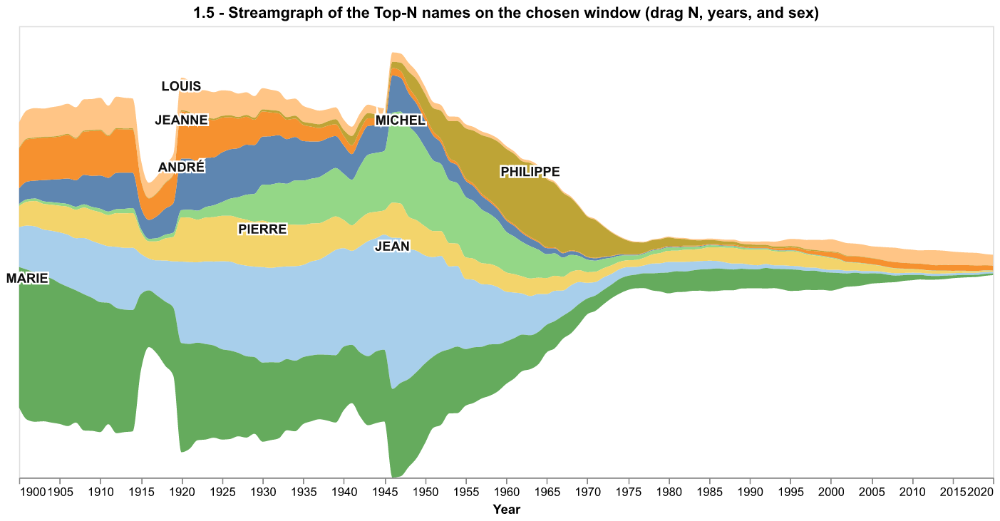
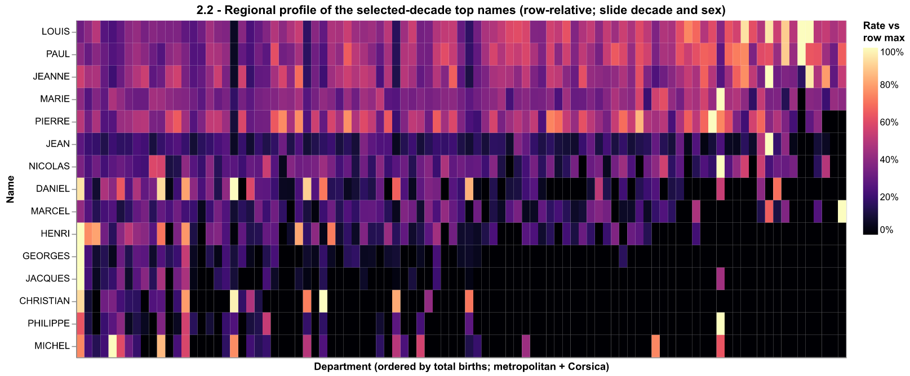
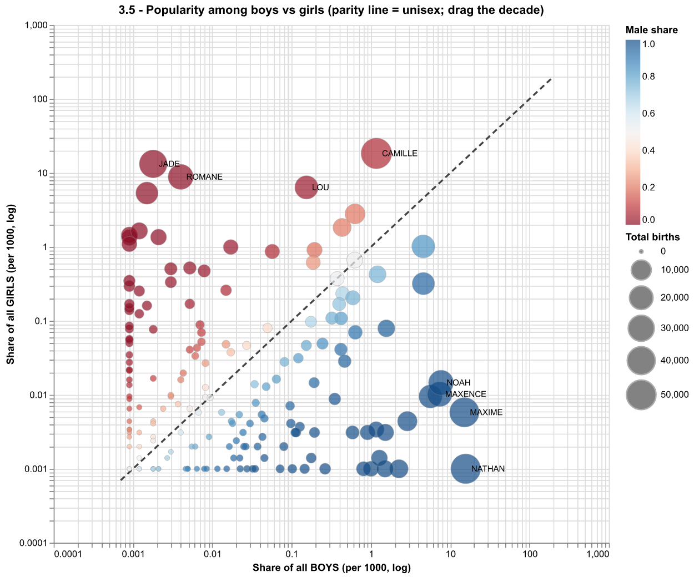

# Telecom Visualization Project

This is our initial implementation for the IGR204 Baby Names mini-project.

Course page: https://perso.telecom-paristech.fr/eagan/class/igr204/baby-names

## Setup

Install the Python requirements:

```bash
python -m pip install -r requirements.txt
```

The original chloropleth notebook has been split into standalone sketches. Each
`sketch_*.ipynb` notebook includes the setup it needs, so sketches can be run
independently.

Run one sketch:

```bash
bash run_sketch_1_5_streamgraph.sh
```

or run all sketches:

```bash
bash run_all.sh
```

On Windows, use the matching `.bat` scripts.

## Notebooks

- `sketch_1_5_streamgraph.ipynb` — evolution over time, Top-N streamgraph
- `sketch_1_2_leaderboard.ipynb` — evolution over time, leaderboard
- `sketch_1_13_compare.ipynb` — evolution over time, compare names
- `sketch_2_4_map.ipynb` — regional effect, choropleth map
- `sketch_2_2_heatmap.ipynb` — regional effect, name x department heatmap
- `sketch_2_6_small_multiples.ipynb` — regional effect, small multiples
- `sketch_3_5_scatter.ipynb` — gender, boys-vs-girls share scatter
- `sketch_3_2_violin.ipynb` — gender, diverging gender bars
- `sketch_3_3_positional.ipynb` — gender, names by gender lean

## Selected visualizations

These are the screenshots of the options we implemented.

### Question 1: Evolution over time



### Question 2: Regional effect



### Question 3: Gender effect


