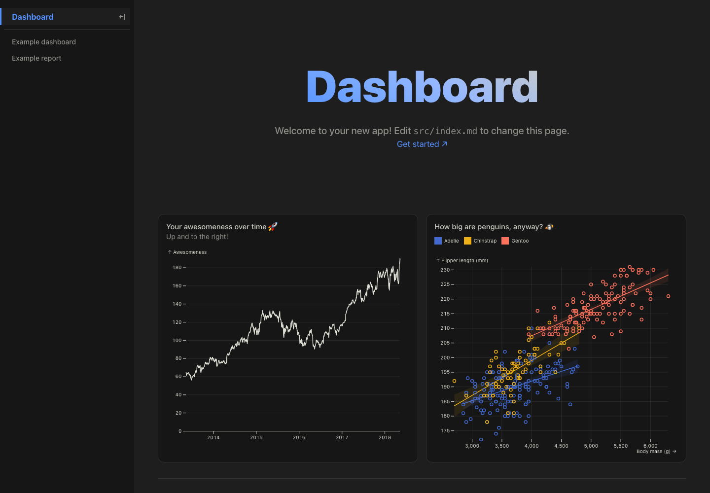

# Telecom Visualization Project

## Notebooks

You can write notebooks either in Python or Javascript.

### Python (Jupyter)

Setup an env:
```bash
python3 -m venv .venv
source .venv/bin/activate
python3 -m pip install uv
python3 -m uv sync
```

Then create/edit `.ipynb` files under [`notebooks/`](./notebooks/). You may optionally use Jupyter Lab

```bash
python3 -m uv run jupyter lab
```

### Javascript (Notebook Kit)

Javascript notebooks are written in [Notebook Kit](https://observablehq.com/notebook-kit/kit).

```
pn install
pn run notebooks:dev
```

You can find an example notebook under [`notebooks/hello_world.html`](./notebooks/hello_world.html). You can use Vega-Lite directly from JavaScript.

## Dashboard



There's also a dashboard. Don't pay much attention to it now. It might possibly be useful later.

```
pn install
pn dashboard:dev
```

## Resources
- https://vega.github.io/vega-lite/
- https://observablehq.com/@vega/hello-vega-embed
- https://observablehq.com/framework/lib/vega-lite
