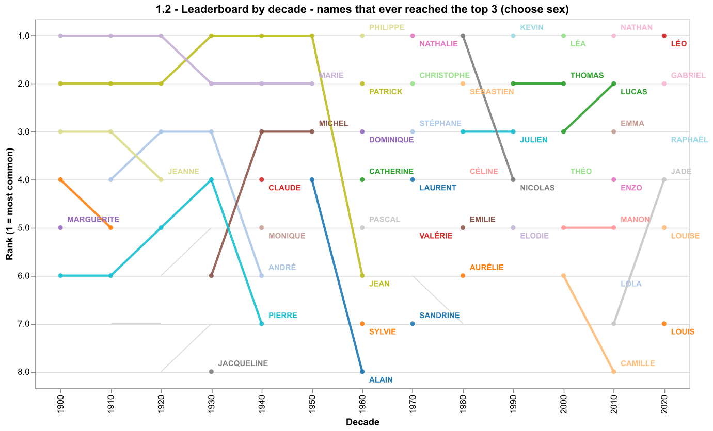
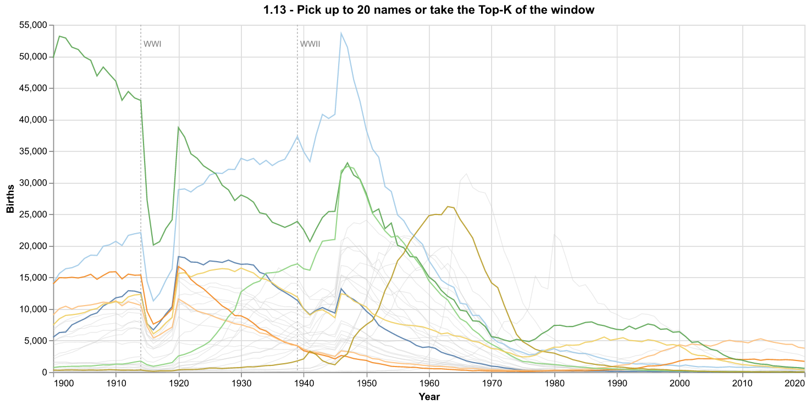
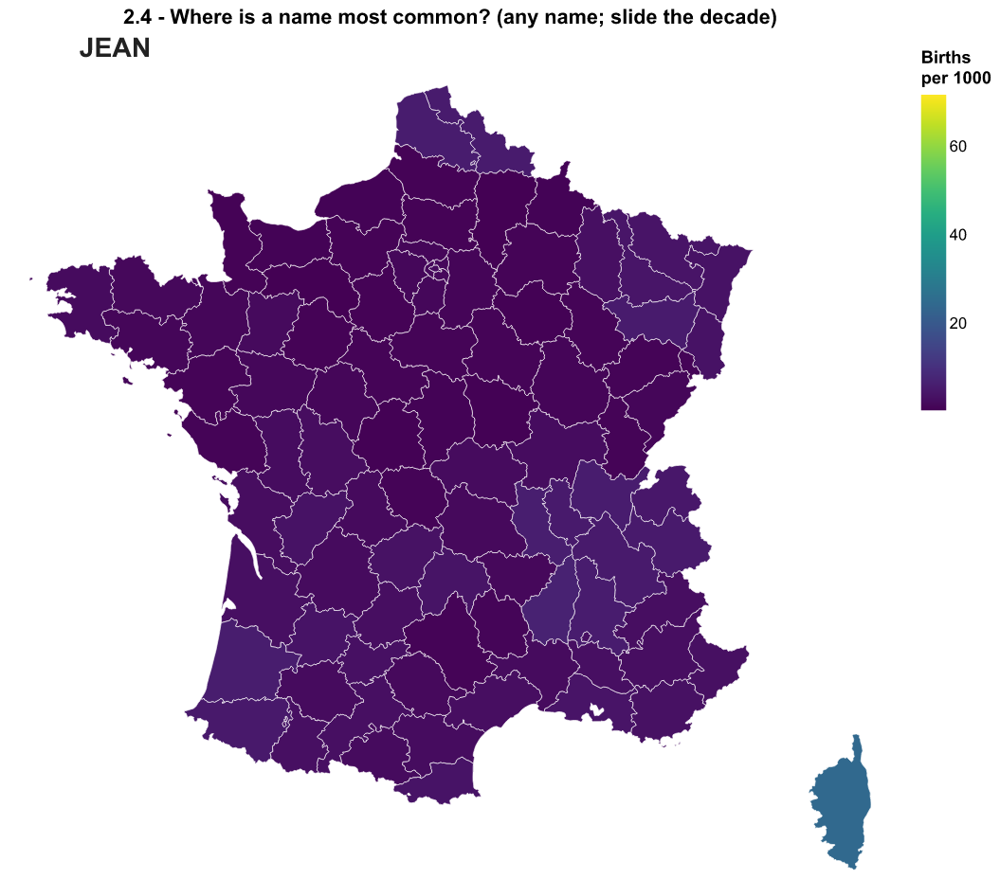
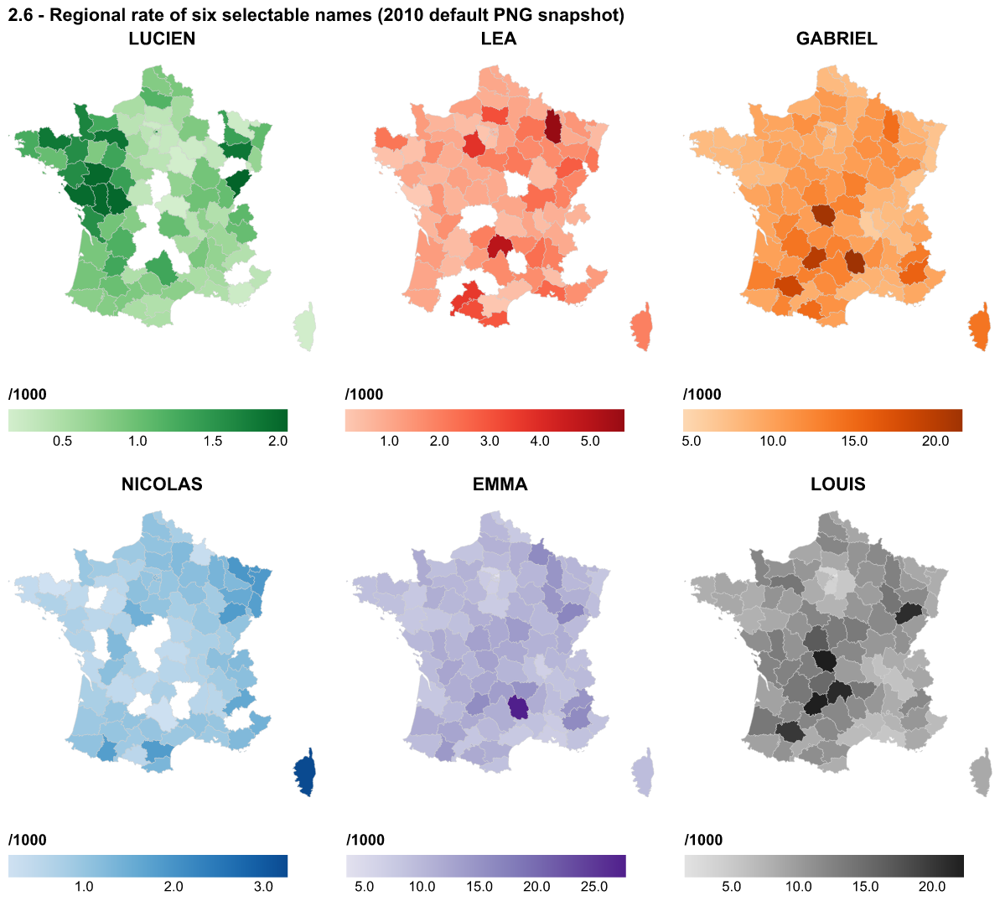
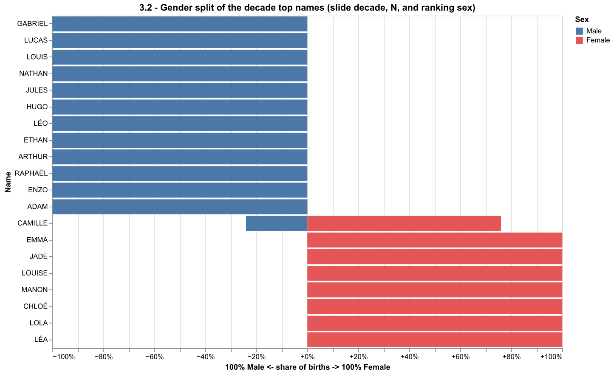
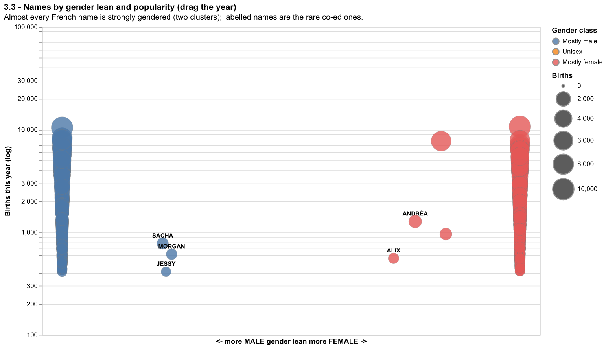

# Telecom Visualization Project

This is our initial implementation for the IGR204 Baby Names mini-project.

Authors:
- Arina Konnova (arina.konnova@ip-paris.fr)
- Amélien Le Meur (amelien.lemeur@ip-paris.fr)
- André Dal Bosco (andre.dalbosco@ip-paris.fr)
- Reda Elwaradi (reda.elwaradi@telecom-paris.fr)
- Julien Gimenez (julien.gimenez@telecom-paris.fr)

Course page: https://perso.telecom-paristech.fr/eagan/class/igr204/baby-names

## Setup

Install the Python requirements:

```bash
python -m pip install -r requirements.txt
```

Each standalone notebook contains one visualization:

- [sketch_1_5_streamgraph.ipynb](sketch_1_5_streamgraph.ipynb) — evolution over time, Top-N streamgraph
- [sketch_1_2_leaderboard.ipynb](sketch_1_2_leaderboard.ipynb) — evolution over time, leaderboard
- [sketch_1_13_compare.ipynb](sketch_1_13_compare.ipynb) — evolution over time, compare names
- [sketch_2_4_map.ipynb](sketch_2_4_map.ipynb) — regional effect, choropleth map
- [sketch_2_2_heatmap.ipynb](sketch_2_2_heatmap.ipynb) — regional effect, name x department heatmap
- [sketch_2_6_small_multiples.ipynb](sketch_2_6_small_multiples.ipynb) — regional effect, small multiples
- [sketch_3_5_scatter.ipynb](sketch_3_5_scatter.ipynb) — gender, boys-vs-girls share scatter
- [sketch_3_2_violin.ipynb](sketch_3_2_violin.ipynb) — gender, diverging gender bars
- [sketch_3_3_positional.ipynb](sketch_3_3_positional.ipynb) — gender, names by gender lean

Run one sketch:

```bash
bash run_sketch_1_5_streamgraph.sh
```

or run all sketches:

```bash
bash run_all.sh
```

On Windows, use the matching `.bat` scripts.

## Selected visualizations

These are the screenshots of the options we implemented.

### Question 1: Evolution over time

Chosen visualization:


Alternative visualizations:

 

### Question 2: Regional effect

Chosen visualization:


Alternative visualizations:

 

### Question 3: Gender effect

Chosen visualization:


Alternative visualizations:

 
